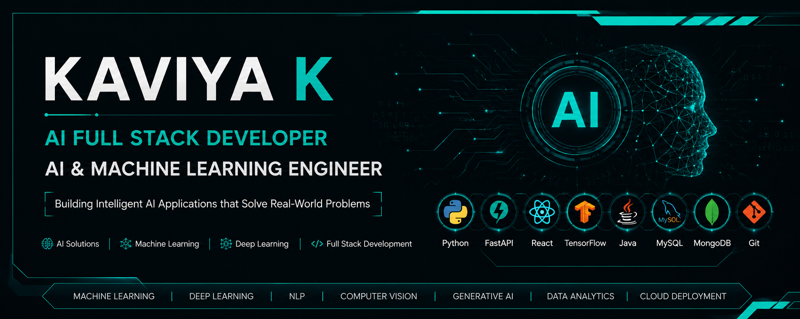

  

# Hi 👋, I'm Kaviya K

### 🚀 AI Full Stack Developer | AI & Machine Learning Engineer

---

## 👨‍💻 About Me

🎓 **B.E. Computer Science & Engineering (Artificial Intelligence & Machine Learning)**

💡 Passionate about building intelligent AI-powered applications that solve real-world problems.

🚀 Interested in:

- Artificial Intelligence
- Machine Learning
- Deep Learning
- Computer Vision
- Natural Language Processing (NLP)
- AI Full Stack Development

🌱 **Currently Learning**

- Data Structures & Algorithms
- FastAPI
- React
- Generative AI
- Large Language Models (LLMs)
- Retrieval-Augmented Generation (RAG)
- MLOps

---

# 🌐 Connect With Me

---

# 💻 Tech Stack

---

# 🤖 AI & Machine Learning

- 🧠 Machine Learning
- 🧠 Deep Learning
- 👁️ Computer Vision
- 💬 Natural Language Processing (NLP)
- 🔥 TensorFlow
- 📊 Scikit-learn
- 📸 OpenCV
- 🐼 Pandas
- 🔢 NumPy

---

# 🚀 Featured Projects

## 🌾 AI-Powered Crop & Livestock Disease Diagnosis

✔ Deep Learning Disease Prediction

✔ Image Classification

✔ FastAPI Backend

✔ JWT Authentication

---

## 📄 Resume Screening System

✔ Resume Classification

✔ NLP

✔ Machine Learning

✔ Scikit-learn

---

## 📈 Sales Forecasting System

✔ Machine Learning Prediction

✔ Data Visualization

✔ Business Analytics

---

# 📊 GitHub Statistics

---

# 🔥 GitHub Streak

---

# 🏆 GitHub Trophies

---

# 📈 Contribution Graph

---

# 🎯 Current Focus

- 🤖 AI Full Stack Development
- 🚀 FastAPI & React
- 🧠 Large Language Models (LLMs)
- 🔍 Retrieval-Augmented Generation (RAG)
- ☁️ Cloud Deployment
- ⚙️ System Design
- 📚 Data Structures & Algorithms

---

# 🎯 Career Goal

To become an **AI Full Stack Developer** by designing scalable, intelligent, and impactful AI-powered solutions that bridge artificial intelligence with modern web technologies.

---

# 📫 Contact Me

📧 **Email:** **kaviyakarikalan19@gmail.com**

💼 **LinkedIn:** https://www.linkedin.com/in/kaviya-k-055900294/

🌐 **Portfolio:** https://kaviyakarikalan.github.io/Portfolio-Kaviya/

💻 **GitHub:** https://github.com/kaviyakarikalan

---

## ⭐ Thanks for visiting my profile!

*"Code. Learn. Build. Innovate with AI."*

